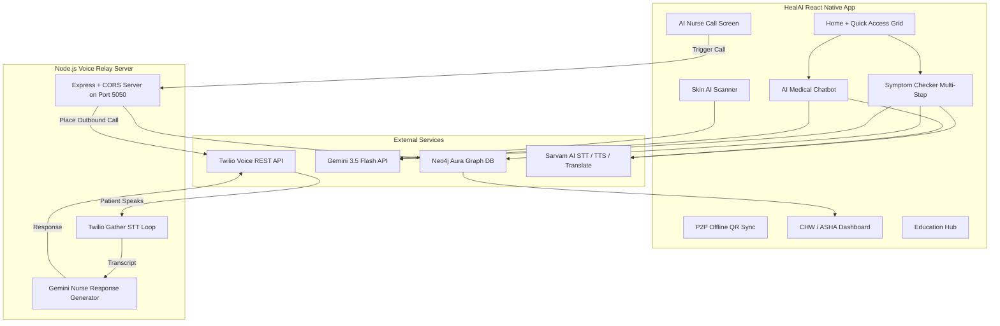

# HealAI — Agentic Clinical Nurse & Triage Platform

HealAI is a full-stack agentic healthcare ecosystem built for rural India, delivering clinical triage, AI nurse voice calls, offline peer-to-peer data syncing, medicine reminders, skin disease scanning, and outbreak surveillance — all in 10+ Indian languages.

The system bridges the digital divide by enabling elders with simple keypad phones to receive high-quality AI clinical consultations in their native language through automated outbound phone calls.

**Tech Stack**: Gemini 3.5 Flash · Twilio Voice · Neo4j Aura DB · Sarvam AI · React Native / Expo · Node.js

---

## 📱 Application Screens

### 🏠 Home Dashboard (`index.tsx`)
The central command center of the application. It displays:
- **Personalized Patient Greeting** with time-aware messages.
- **Daily Clinical Insight Card** — Gemini-generated health tips localized to the user's language, refreshed daily.
- **Quick Access Grid** — shortcuts to Symptom Checker, Report Scanner, Health Chat, AI Nurse Call, Pill Reminders, and Case History.
- **Outbreak Radar Alert Banner** — automatically displayed when the AI detects a geographic cluster of infectious symptoms within 48 hours.
- **ASHA/CHW Mode Shortcuts** — if the user is registered as a community health worker, a dedicated dashboard shortcut appears.

---

### 🩺 Symptom Checker (`symptoms.tsx`)
The most advanced screen in the app. A multi-step interactive clinical diagnosis agent:
- **Step-by-Step Interview**: Collects patient demographics (name, age, gender), active symptoms (with severity and duration), pre-existing conditions, and current medications.
- **Gemini Clinical Analysis**: Sends the structured symptom data to Gemini for clinical reasoning and diagnosis.
- **Structured Output**: Returns possible conditions with likelihood scores, urgency level (Emergency/Urgent/Moderate/Routine), and recommended immediate actions.
- **Recovery Roadmap**: Generates a full 7-day care plan including hydration, diet, medication guidance, and when to see a doctor.
- **SOAP Note Generator**: Auto-generates a clinical SOAP Note (Subjective, Objective, Assessment, Plan) for the session.
- **Neo4j Persistence**: Saves every check as a `(:SymptomCheck)` graph node linked to the patient.
- **Multilingual**: All outputs are localized via Sarvam AI translation to the user's selected language.

---

### 💬 AI Medical Chatbot (`chat.tsx`)
A full-featured medical chat interface powered by Gemini:
- **Medical Context System Prompt**: HealAI Assistant uses a specialized medical context ensuring proper terminology, clinical formatting, and safe advice.
- **Image Uploads**: Allows attaching medical images (rashes, wounds, prescriptions) directly inside the chat for visual diagnosis.
- **Chat History**: Maintains a rolling conversation history for multi-turn clinical consultations.
- **Markdown Rendering**: Responses rendered with rich markdown (headings, bullet lists, bold findings).
- **Multilingual Chat**: Detects and responds in the user's configured language.

---

### 📋 Reports & Health Profile (`reports.tsx`)
A comprehensive health records management screen with four tabs:
- **Profile Tab**: Stores user demographics, blood group, allergies, and medication list in both AsyncStorage and Neo4j.
- **Reports Tab**: Allows uploading lab reports, MRI scans, CT scans, X-rays, and prescription images. Uses Gemini Vision to analyze and extract structured clinical insights from each file.
- **Diet Tab**: Generates an AI-personalized diet plan based on the patient's age, gender, conditions, and medications.
- **Advice Tab**: Produces customized daily health guidance and preventive care recommendations.
- **Prescription Scanner**: Uses the device camera to OCR and digitize handwritten prescriptions.

---

### ➕ More Settings & Tools (`more.tsx`)
A settings hub with multiple functional sections:
- **Clinical Records**: Quick links to Case History and the CHW/ASHA Dashboard (visible only when ASHA mode is enabled).
- **Health Tools**: Links to the Education Hub and Nearby Healthcare Resources.
- **App Language**: Live language switcher for 10+ Indian languages (persisted across sessions).
- **Emergency Contacts**: One-tap emergency dialing for 112 (Police/Emergency) and 108 (Ambulance).
- **App Distribution — Smart P2P Share**: Generates a dynamic QR code containing the patient's compressed clinical profile and latest report analysis for offline P2P sync with other health workers.
- **ASHA Worker Mode Toggle**: Unlocks the CHW dashboard and additional tools.
- **Medical Disclaimer**: HIPAA/GDPR-aligned disclaimer prominently displayed.

---

## 🗂️ Additional Screens

### 📞 AI Nurse Call Screen (`nurse-call.tsx`)
The outbound AI Nurse voice triage interface:
- **Family Member Registry**: Add/remove registered family members with their name, phone number, preferred language, relationship, and age, all saved to Neo4j.
- **Dual Calling Modes**: Trigger a call to a registered family member from the registry, or use the direct dial mode for any phone number.
- **Live Call Simulation**: Animated waveform and live transcript display during the simulated session.
- **AI Chat During Call**: Type symptoms for the elder during a consultation; Gemini responds as the AI Nurse.
- **Post-Call ESI Analysis**: When the call ends, the full transcript is sent to Gemini for ESI scoring, condition extraction, and summary generation.
- **Neo4j Nurse Call Record**: Saves the call record as a `(:NurseCall)` graph node with ESI score, duration, language, and conditions.
- **Urgent Notification**: If ESI ≤ 3 (high priority), a local push notification is sent to the caregiver device.

---

### 🏥 CHW / ASHA Dashboard (`chw-dashboard.tsx`)
A clinical operations command center for community health workers:
- **Nurse Call Alerts Tab**: Displays all completed AI Nurse Call records sorted by ESI urgency. High-priority cases (ESI 1–3) are highlighted in red.
- **Patient Registry**: Shows all registered patients with their last check date, current conditions, and ESI severity.
- **Outbreak Tracker**: Displays active outbreak radar alerts with geographic cluster summaries.
- **Case Prioritization**: Auto-sorts patients by urgency so CHWs can focus on the most critical cases first.

---

### 🎓 Education Hub (`education.tsx`)
A health literacy content hub designed for rural communities:
- **Curated Health Articles**: AI-generated health education articles on common rural health topics (dengue, malaria, malnutrition, maternal health, water-borne diseases, etc.).
- **Video Learning**: Embedded educational videos for visual learners.
- **Search & Filter**: Search articles by keyword or browse by health topic category.
- **Multilingual Content**: Article content is translated to the user's preferred language.

---

### 🔬 Skin AI Scanner (`skin-scanner.tsx`)
A visual dermatology diagnostic tool:
- **Camera & Upload**: Capture a live photo or upload from gallery.
- **Gemini Vision Analysis**: Sends the image to Gemini Vision API, identifying visible skin conditions with a probability estimate, clinical description, recommended management, and urgency level.
- **Scan History**: All past scans are saved locally and synced to Neo4j as `(:SkinScan)` nodes.
- **Reset & Re-scan**: After viewing results, re-scan a new area instantly.

---

### 📅 Pill Reminders (`reminders.tsx`)
A medication adherence assistant:
- **Add Reminders**: Schedule reminders by medication name, dose, frequency, and time.
- **Push Notifications**: Uses Expo Notifications to send scheduled local alerts when it is time to take medication.
- **CRUD Management**: View, add, and delete all active reminders.
- **Persistence**: Reminders stored in AsyncStorage with notification IDs for reliable cancellation.

---

### 🚨 Priority Alerts (`priority.tsx`)
A real-time urgency notification screen:
- Displays all patient-level alerts generated by the AI, including ESI-triggered alerts, outbreak radar warnings, and ASHA nurse call summaries.
- Each alert shows a color-coded severity badge, timestamp, and a summary of the clinical concern.

---

### 📊 Diagnosis Result (`diagnosis-result.tsx`)
A detailed clinical result viewer for completed symptom checks:
- Renders the full structured Gemini diagnosis output including conditions, urgency levels, SOAP notes, and the 7-day recovery roadmap.
- Supports sharing the result as a formatted text summary via the OS share sheet.

---

### 📄 Doctor Report (`doc-report.tsx`)
A structured clinical report generator for professional sharing:
- Formats the patient's symptom check data and Gemini analysis results into a professional clinical report PDF layout.
- Ideal for sharing with a doctor, telemedicine platform, or government health system.

---

### 📜 Case History (`history.tsx`)
A chronological timeline of all past clinical sessions:
- Pulls `(:SymptomCheck)` nodes from Neo4j, displaying each check with its date, chief complaint, conditions, ESI score, and urgency level.
- Supports deleting individual records.
- Falls back to AsyncStorage if the graph database is unreachable.

---

### 🔔 Notify Screen (`notify-screen.tsx`)
A notification center for push alerts:
- Lists all recent local push notifications sent by the app (nurse call alerts, outbreak warnings, medicine reminders).
- Displays title, body, timestamp, and associated data for each notification.

---

### 🔑 Login Screen (`login.tsx`)
The authentication entry point:
- Supports name-based patient registration and session persistence using AsyncStorage.
- Registers the patient profile to Neo4j on first login as a `(:Patient)` node.
- ASHA worker role toggle available at login.

---

### 🌐 Healthcare Resources (`resources.tsx`)
A directory of nearby healthcare infrastructure:
- Lists government hospitals, primary health centres, ASHA offices, and emergency contacts by district.
- Integrates with device maps for one-tap navigation to the nearest healthcare facility.

---

## 🔧 Backend Services

| Service | Purpose |
|---|---|
| `gemini.ts` | Core Gemini 3.5 Flash API client with 3-key task-specific rotation, exponential backoff on 503 errors, deterministic temperature (T=0) for clinical tasks |
| `neo4jService.ts` | Full Neo4j Aura graph database CRUD — symptom checks, patient profiles, family members, nurse calls, audit logs, outbreak status |
| `voiceCallService.ts` | Twilio outbound call trigger via backend relay + ESI transcript analysis |
| `sarvamService.ts` | Sarvam AI Text-to-Speech, Speech-to-Text, and Translation APIs for 10 Indian languages |
| `outbreakRadarService.ts` | Spatio-temporal outbreak detection — queries Neo4j for 48hr symptom clusters, passes to Gemini AI epidemiologist, schedules background scan every 6 hours |
| `notificationService.ts` | Expo local push notification scheduling — nurse call alerts, medicine reminders, outbreak warnings |
| `soapService.ts` | SOAP Note generator — converts Gemini diagnosis output to structured Subjective/Objective/Assessment/Plan clinical notes |
| `symptomCheckerService.ts` | Multi-stage symptom analysis pipeline — interview data collection, Gemini clinical reasoning, output parsing, urgency mapping |
| `medicalBotService.ts` | Medical chatbot context system and image-capable response generator |
| `dailyInsightsService.ts` | Generates localized daily clinical health tips from Gemini |

---

## 🛠️ System Architecture



---

## 🗄️ Neo4j Graph Database Schema

```
(:Patient { id, name, address, phone, role })
    -[:HAS_FAMILY]->   (:FamilyMember { id, name, phone, language, relationship, age })
    -[:HAD_CHECK]->    (:SymptomCheck { id, symptoms, urgency, esiScore, conditions, soapNote, timestamp })
    -[:REQUESTED_CALL]->(:NurseCall { id, phone, language, esiScore, summary, conditions, duration, timestamp })

(:SymptomCheck)-[:POTENTIAL_CONDITION]->(:Condition { name })
(:NurseCall)-[:ALERTED]->(:Caregiver)
```

---

## 🌍 Supported Languages

| Language | Code | Voice Call | Symptom Checker | Chat |
|---|---|---|---|---|
| Hindi | hi-IN | ✅ | ✅ | ✅ |
| English | en-IN | ✅ | ✅ | ✅ |
| Tamil | ta-IN | ✅ | ✅ | ✅ |
| Telugu | te-IN | ✅ | ✅ | ✅ |
| Bengali | bn-IN | ✅ | ✅ | ✅ |
| Marathi | mr-IN | ✅ | ✅ | ✅ |
| Gujarati | gu-IN | ✅ | ✅ | ✅ |
| Kannada | kn-IN | ✅ | ✅ | ✅ |
| Malayalam | ml-IN | ✅ | ✅ | ✅ |
| Punjabi | pa-IN | ✅ | ✅ | ✅ |
| Odia | or-IN | ❌ | ✅ | ✅ |

---

## 🚀 Setup & Installation

### Prerequisites
- Node.js ≥ 20.x
- Expo CLI (`npm install -g expo-cli`)
- Twilio Account with a verified outbound number
- Google AI Studio API Keys (×3, task-distributed)
- Neo4j Aura Free DB instance
- Sarvam AI API Key
- Tunnel utility: `ngrok` / `cloudflare tunnel` / `localtunnel`

---

### Part 1: Mobile App Setup

```bash
cd HealAI-Mobile
npm install
npx expo start
```

Update tunnel URL in [voiceCallService.ts](./HealAI-Mobile/src/services/voiceCallService.ts):
```typescript
export const VOICE_SERVER_URL: string = 'https://your-tunnel-url.ngrok-free.app';
```

---

### Part 2: Backend Voice Server Setup

```bash
cd HealAI-Voice-Server
npm install
```

Create `.env`:
```env
TWILIO_ACCOUNT_SID=ACxxxxxxxxxxxxxxxx
TWILIO_AUTH_TOKEN=xxxxxxxxxxxxxxxx
GEMINI_API_KEY=AQ.xxxxxxxxxxxxxxxx
SARVAM_API_KEY=sk_xxxxxxxxxxxxxxxx
NEO4J_URI=bolt+routing://xxxxxxxx.databases.neo4j.io
NEO4J_USER=neo4j
NEO4J_PASSWORD=xxxxxxxxxxxxxxxx
PORT=5050
```

Start the server:
```bash
npm start
```

---

### Part 3: Twilio Webhook Configuration

1. Start your tunnel:
   ```bash
   ngrok http 5050
   ```
2. Copy the HTTPS public URL.
3. Go to **Twilio Console** → **Active Numbers** → click your number.
4. Under **Voice → A Call Comes In**, set Webhook to:
   ```
   https://your-tunnel-url.ngrok-free.app/voice
   ```
5. Set method to **HTTP POST** → **Save**.

---

## 🔐 Security Notes

- All Neo4j connections use encrypted Bolt+routing protocol.
- Twilio credentials are server-side only — never exposed to the client app.
- Patient data is stored locally in `AsyncStorage` (AES encrypted device storage) and only synced to Neo4j when connectivity is available.
- Gemini API keys are rotated per task category to distribute rate limits and minimize exposure of any single key.

---

*Made with ❤️ for better health in rural India — HealAI v1.0.0 © 2026*
